# job-pipeline

A LangGraph multi-agent job application pipeline. Four agents — Discoverer, Writer,
Submitter, Tracker — coordinate to automate job search, document generation, ATS form
submission, and follow-up tracking.

**Branch:** `checkpoint/discoverer-e2e-playwright-salary`  
**Tests:** 147 passing  
**Sources working:** LinkedIn, Dice, ZipRecruiter, Built In Chicago

---

## Architecture

```mermaid
flowchart TD
    CLI(["pipeline CLI"])
    CLI -->|discover| D
    CLI -->|write JOB_ID| W
    CLI -->|submit JOB_ID| S
    CLI -->|track| T
    CLI -->|run| FLOW["discover → write → submit → track"]

    subgraph D["Discoverer"]
        direction LR
        d1["scrape\n(parallel Send)"] --> d2["merge & dedup"] --> d3["triage\n⚡ interrupt"] --> d4["persist"]
    end

    subgraph W["Writer"]
        direction LR
        w1["interview\n⚡ interrupt"] --> w2["LLM generate"] --> w3["review\n⚡ interrupt"]
        w3 -->|approved| w4["persist JSON"]
        w3 -->|feedback| w2
    end

    subgraph S["Submitter"]
        direction LR
        s1["scan form"] --> s2["render docs\nif needed"] --> s3["fill form"] --> s4["gate\n⚡ interrupt"] -->|yes| s5["submit & receipt"]
    end

    subgraph T["Tracker"]
        direction LR
        t1["load"] --> t2["schedule\nfollow-ups"] --> t3["flag\noverdue"] --> t4["dashboard"]
    end

    DB[("SQLite\npipeline.db")]
    CDB[("SQLite\ncheckpoints.db")]
    D & W & S & T --> DB
    D & W & S -.->|"checkpoint"| CDB
```



**⚡ interrupt** = LangGraph `interrupt()` — state checkpoints here, terminal waits,
resumes via `Command(resume=...)`. Safe to close the terminal and continue later.

See [docs/architecture.md](docs/architecture.md) for agent topologies, implementation
decisions, source status, LangGraph pattern reference, and local test walkthrough.

---

## Quickstart

**Requirements:** Python 3.11+, [uv](https://docs.astral.sh/uv/), Windows (Playwright auth)

```powershell
git clone https://github.com/montal95/job-pipeline
cd job-pipeline
uv sync

# Configure
& .\.venv\Scripts\pipeline.exe config set ANTHROPIC_API_KEY sk-ant-YOUR-KEY
& .\.venv\Scripts\pipeline.exe config set CV_PATH "C:\path\to\resume.pdf"
& .\.venv\Scripts\pipeline.exe db migrate

# Save LinkedIn auth session (one-time)
python scripts\save_auth.py --platform linkedin

# Run discovery
& .\.venv\Scripts\pipeline.exe discover --query "rails engineer" --location "Chicago, IL" --sources "linkedin,dice,ziprecruiter,builtin"
```

**Running tests:**
```powershell
& .\.venv\Scripts\python.exe -m pytest tests/ -q
```

---

## CLI reference

| Command | Description |
|---------|-------------|
| `pipeline discover` | Search all sources, triage results, persist approved jobs |
| `pipeline write <job_id>` | Generate tailored resume + cover letter for a queued job |
| `pipeline submit <job_id>` | Fill and submit ATS form for a job with docs ready |
| `pipeline track` | Show status dashboard, flag overdue follow-ups |
| `pipeline run` | Full pipeline: discover → write → submit → track |
| `pipeline db migrate` | Apply pending DB migrations |
| `pipeline config set KEY VALUE` | Write a key to `.env` |
| `pipeline config show` | Print current config (API keys masked) |

`--sources` accepts `linkedin`, `dice`, `ziprecruiter`, `builtin` (comma-separated).  
LinkedIn requires a saved auth session — run `scripts/save_auth.py` first.

---

## Project structure

```
src/pipeline/
  config.py          # pydantic-settings + LLM_MODEL pin
  state.py           # PipelineState TypedDict + Pydantic models
  database.py        # aiosqlite connection + migration runner
  graph.py           # Top-level graph + AsyncSqliteSaver checkpointing
  cli.py             # typer CLI — all subcommands + interrupt/resume loops
  agents/
    discoverer.py    # Playwright scrapers, Send fan-out, triage interrupt
    writer.py        # LLM generation, revision cycle, 2 interrupt gates
    submitter.py     # ATS form fill, conditional render, hard submission gate
    tracker.py       # Rich dashboard, follow-up scheduling, overdue detection
migrations/
  001_initial.sql                  # jobs, submissions, search_runs, company_cache
  002_content_json_columns.sql     # resume/cover letter content JSON columns
  003_updated_at_column.sql        # updated_at on jobs
  004_fingerprint_unique.sql       # UNIQUE constraint on jobs.fingerprint
scripts/
  save_auth.py       # Interactive Chrome login → playwright/.auth/
tests/
  fixtures/          # HTML DOM refs, JSON LLM responses, Python dict fixtures
  conftest.py        # Shared fixtures: sample_job, seeded_db
  test_smoke.py      # Graph compile checks (4)
  test_state.py      # Schema + enums (7)
  test_ats.py        # ATS URL fingerprinting (6)
  test_config.py     # .env helpers (13)
  test_database.py   # get_connection() (5)
  test_discoverer.py # Scrapers + parsers (58)
  test_writer.py     # CV, prompts, rendering, nodes (19)
  test_submitter.py  # Form parsing, routing (13)
  test_tracker.py    # Status, overdue, dashboard (9)
docs/
  architecture.md    # Deep dive: agents, decisions, sources, LangGraph patterns
```

---

## Roadmap

### v1 — CLI pipeline (current)

All core phases complete. Active work is on stability, source coverage, and known
limitations before merging to `development`.

| Area | Status | Notes |
|------|--------|-------|
| Scaffolding, state schema, DB, CLI | ✅ | |
| Discoverer — Send fan-out, triage interrupt | ✅ | |
| Playwright auth sessions | ✅ | LinkedIn working |
| Writer — LLM generation, revision loop | ✅ | Requires API credits |
| Submitter — ATS form fill, submission gate | ✅ | Greenhouse full; Workday manual fallback |
| Tracker — Rich dashboard, follow-up scheduling | ✅ | |
| Discoverer sources expanded | ✅ | LinkedIn, Dice, ZipRecruiter, Built In Chicago |
| Indeed | 🅿️ | CAPTCHA blocks Playwright |
| Wellfound | 🅿️ | IP-based bot detection — grep `WELLFOUND_PARKED` |
| Submitter — ZipRecruiter auth | 🔜 | `save_auth.py --platform ziprecruiter` |
| Submitter — Ashby ATS strategy | 🔜 | DOM fingerprint research needed |
| PR: checkpoint branch → development | 🔜 | |

### v2 — Web UI

| Area | Notes |
|------|-------|
| FastAPI server + React dashboard | Replace CLI triage with browser UI |
| Job card review with approve/skip/save | Visual triage instead of terminal prompts |
| Document preview before submission | Side-by-side resume/cover letter viewer |
| Pipeline run status in real time | WebSocket progress feed |
| Playwright browser containerization | `storage_state` volume mount for auth inside Docker |
